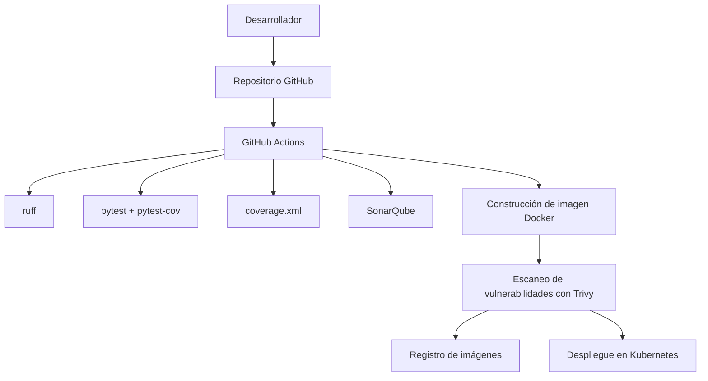
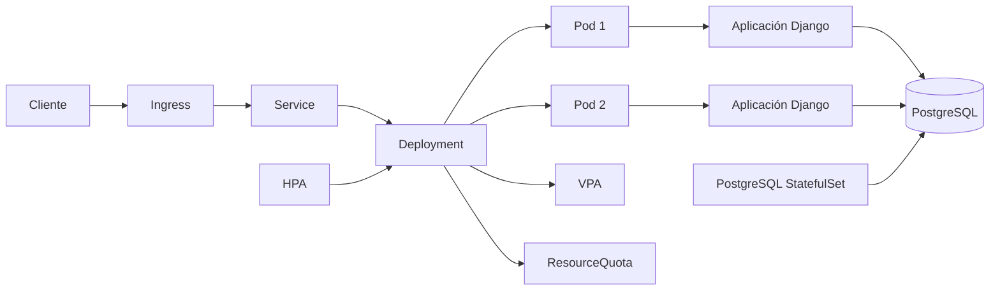

# Arquitectura
## 1. Objetivo del sistema

La aplicación es un servicio REST en Django que expone operaciones para gestionar usuarios mediante API. Su arquitectura está diseñada para permitir:

- desarrollo local rápido
- contenedorización con Docker
- integración y despliegue continuo con GitHub Actions
- ejecución en Kubernetes con escalabilidad y observabilidad básica

## 2. Componentes principales

### Aplicación
- Framework: Django + Django REST Framework
- Servidor: Gunicorn
- Endpoints principales:
  - `GET /api/health/`
  - `GET /api/users/`
  - `POST /api/users/`
  - `GET /api/users/<id>/`

### Infraestructura
- Contenedor Docker para ejecutar la app de forma consistente
- Kubernetes para orquestación y alta disponibilidad
- Persistencia con PostgreSQL (StatefulSet con su propio volumen)
- Aplicación *stateless* para permitir escalado horizontal
- Balanceo de tráfico mediante Service e Ingress

## 3. Arquitectura de CI/CD

### Flujo de CI/CD
1. Se dispara un push o pull request.
2. GitHub Actions ejecuta lint, tests y cobertura.
3. Se genera un reporte de calidad y cobertura.
4. Se construye la imagen Docker.
5. Se escanea la imagen en busca de vulnerabilidades con Trivy.
6. Se publica la imagen y se despliega la aplicación en Kubernetes.

## 4. Arquitectura de ejecución en Kubernetes

## 5. Seguridad

### Medidas implementadas
- Variables sensibles gestionadas con `Secret` en Kubernetes
- Configuración no sensible separada en `ConfigMap`
- TLS preparado para Ingress mediante un `Secret` de tipo TLS
- Health probes para detectar fallas de forma temprana
- Namespace aislado para controlar recursos y permisos

### Consideraciones recomendadas
- Usar un registro privado para imágenes en producción
- Rotar secretos de forma periódica
- Proteger el acceso al cluster mediante RBAC
- Usar HTTPS real con un certificado emitido por una autoridad certificadora

## 6. Escalabilidad y disponibilidad

### Escalabilidad horizontal
- La base de datos se externalizó a **PostgreSQL**, lo que vuelve la aplicación *stateless* y permite múltiples réplicas.
- El `HorizontalPodAutoscaler` ajusta el número de réplicas (de 2 a 5) según uso de CPU (70%) y memoria (80%).
- El `Deployment` usa estrategia `RollingUpdate` (con `maxUnavailable: 0`) para despliegues sin downtime, e initContainers (`wait-for-db` → `migrate`) que garantizan el esquema antes de servir tráfico.

### Escalabilidad vertical
- El `VerticalPodAutoscaler` ajusta los recursos del contenedor cuando el cluster soporta el CRD.

### Gestión de recursos
- `ResourceQuota` limita consumo de CPU, memoria, pods y servicios por namespace.
- PostgreSQL persiste sus datos en un volumen propio (`volumeClaimTemplate`, `ReadWriteOnce`) gestionado por el `StatefulSet`.

## 7. Operación y despliegue

### Local
- Se puede ejecutar con Python, Docker o Docker Compose.

### Kubernetes
- Se aplica con `kubectl apply -k k8s`.
- El namespace se centraliza en `k8s/kustomization.yaml`.
- Los recursos se despliegan como una unidad lógica y reproducible.

## 8. Resumen ejecutivo

La solución combina una API Django simple con prácticas modernas de DevOps:

- calidad automática con Ruff y SonarQube
- pruebas automatizadas con pytest
- cobertura de pruebas con pytest-cov
- contenedorización con Docker
- despliegue reproducible en Kubernetes
- base de datos PostgreSQL que permite una aplicación *stateless*
- escalabilidad horizontal con HPA, vertical con VPA y control de recursos con ResourceQuota
