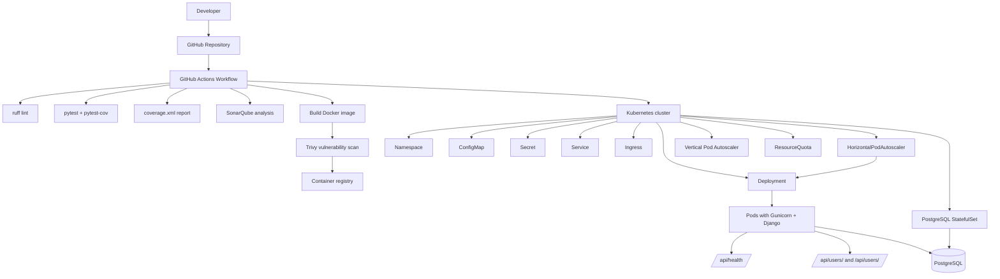

# Demo DevOps Python

API REST sencilla en Django (Django REST Framework) para gestionar usuarios, usada como prueba
técnica de DevOps. Expone un CRUD de usuarios y un endpoint de *health check*.

## Stack

- **Lenguaje / framework:** Python 3.11, Django + Django REST Framework
- **Servidor:** Gunicorn
- **Base de datos:** PostgreSQL
- **Contenedores:** Docker / Docker Compose
- **Orquestación:** Kubernetes (Traefik como Ingress Controller)
- **CI/CD:** GitHub Actions (ruff, pytest, SonarQube, Trivy)

## Requisitos

| Para... | Necesitas |
|---|---|
| Correr en local | Python 3.11+ y Docker (para la base de datos) |
| Correr con contenedores | Docker + Docker Compose |
| Desplegar en Kubernetes | `kubectl` + acceso a un cluster |

## Instalación

Clona el repositorio:

```bash
git clone https://github.com/diego12-ui/demo-devops-python.git
cd demo-devops-python
```

## Variables de entorno

La app se configura por variables de entorno (archivo `.env` en local). Copia el ejemplo:

```bash
cp .env.example .env
```

| Variable | Descripción | Ejemplo |
|---|---|---|
| `DJANGO_SECRET_KEY` | Clave secreta de Django | `una-clave-larga-y-aleatoria` |
| `DEBUG` | Modo debug | `True` (local) / `False` (prod) |
| `ALLOWED_HOSTS` | Hosts permitidos por Django | `127.0.0.1,localhost` |
| `DATABASE_NAME` | Nombre de la base | `devsu` |
| `DATABASE_USER` | Usuario de la base | `devsu` |
| `DATABASE_PASSWORD` | Contraseña de la base | `devsu` |
| `DATABASE_HOST` | Host de PostgreSQL | `localhost` |
| `DATABASE_PORT` | Puerto de PostgreSQL | `5432` |

> **Nota:** La app usa **PostgreSQL**. Se reemplazó SQLite porque es de un solo escritor sobre un
> archivo local y no permite múltiples réplicas; PostgreSQL vuelve la app *stateless* y habilita el
> escalado horizontal (HPA).

## Cómo ejecutar

Hay tres formas de correr la app. Elige la que necesites.

### Opción A — Docker Compose (la más rápida)

Levanta app + base de datos, con migraciones automáticas.

```bash
# 1. Copia las variables de entorno
cp .env.example .env

# 2. Construye y levanta todo
docker compose up --build

# 3. Verifica (en otra terminal)
curl http://localhost:8000/api/health/
```

Detener y borrar los datos: `docker compose down -v`.

➡️ Para probar los endpoints, ve a [Probar las APIs](#probar-las-apis) con `BASE_URL=http://localhost:8000`.

### Opción B — Local (sin contenedores)

```bash
# 1. Entorno virtual + dependencias
python3 -m venv .venv
source .venv/bin/activate
pip install -r requirements.txt -r requirements-dev.txt

# 2. Base de datos PostgreSQL (la forma más simple)
docker compose up db          # expone PostgreSQL en localhost:5432

# 3. Variables de entorno (DATABASE_HOST=localhost)
cp .env.example .env

# 4. Migraciones + servidor
python manage.py migrate
python manage.py runserver 0.0.0.0:8000

# 5. Verifica
curl http://localhost:8000/api/health/
```

**Pruebas y calidad:**

```bash
pytest                                                  # pruebas unitarias
pytest --cov=api --cov=demo --cov-report=term-missing   # con cobertura
ruff check .                                            # análisis estático (lint)
```

➡️ Para probar los endpoints, ve a [Probar las APIs](#probar-las-apis) con `BASE_URL=http://localhost:8000`.

### Opción C — Kubernetes

Los manifiestos están en `k8s/` (aplicados con Kustomize). Incluyen:

- Namespace, ConfigMap, Secret
- **PostgreSQL** (StatefulSet + Service headless con volumen `ReadWriteOnce`)
- **Deployment** (stateless, 2 réplicas, RollingUpdate; initContainers `wait-for-db` → `migrate`)
- Service e Ingress
- **HPA** (2–5 réplicas según CPU/memoria) y **VPA**
- **ResourceQuota**
- Probes de *liveness*, *readiness* y *startup* en `/api/health/`

#### C.1 Prerrequisitos del cluster

- `kubectl` configurado contra un cluster accesible.
- Un **Ingress Controller** con la IngressClass `traefik`. El pipeline de CI/CD instala Traefik
  automáticamente vía Helm; para un `apply` manual, instálalo tú:
  `helm install traefik traefik/traefik -n traefik --create-namespace`.
- **metrics-server** instalado (sin él, el HPA marca `<unknown>` y no escala):
  `kubectl get deployment metrics-server -n kube-system`.
- Define una **contraseña real** en `k8s/secret.yaml` (`DATABASE_PASSWORD`) **antes del primer
  `apply`** — PostgreSQL solo la lee al inicializar su volumen por primera vez.

#### C.2 Desplegar

```bash
kubectl apply -k k8s
```

El namespace se centraliza en [k8s/kustomization.yaml](k8s/kustomization.yaml).

#### C.3 Verificar el estado

```bash
kubectl get pods -n devsu-demo-python
kubectl get statefulset -n devsu-demo-python
kubectl get svc,ingress,hpa -n devsu-demo-python
```

Debe quedar: PostgreSQL `Running`, 2 pods `web` `Running` (tras los initContainers `wait-for-db` →
`migrate`) y el HPA con réplicas asignadas.

#### C.4 Acceder a la app

**Opción 1 — Por el dominio público** (Ingress `api.pluscloudit.pe`):

```bash
curl https://api.pluscloudit.pe/api/health/
```

> El dominio debe resolver hacia el Ingress. Si aún no tienes DNS público, apúntalo en tu
> `/etc/hosts` a la IP del Ingress: `echo "<IP_INGRESS> api.pluscloudit.pe" | sudo tee -a /etc/hosts`.
> Usa `-k` en `curl` si el certificado TLS es autofirmado.

**Opción 2 — Con `port-forward`** (si alcanzas la red del cluster):

```bash
kubectl port-forward -n devsu-demo-python svc/devsu-demo-python 8000:80
curl http://localhost:8000/api/health/
```

**Opción 3 — Desde dentro de un pod** (si no alcanzas la red del cluster, p. ej. shell web de Rancher):

```bash
kubectl exec -n devsu-demo-python deploy/devsu-demo-python -c web -- \
  python -c "import urllib.request; print(urllib.request.urlopen('http://localhost:8000/api/health/').read())"
```

➡️ Para probar los endpoints, ve a [Probar las APIs](#probar-las-apis) con:
- `BASE_URL=https://api.pluscloudit.pe` (dominio público), o
- `BASE_URL=http://localhost:8000` (si usaste `port-forward`).

## Probar las APIs

Define primero la URL base según tu entorno y luego ejecuta los mismos comandos:

| Entorno | `BASE_URL` |
|---|---|
| Local / Docker / Compose | `http://localhost:8000` |
| Kubernetes (`port-forward`) | `http://localhost:8000` |
| Kubernetes (dominio público) | `https://api.pluscloudit.pe` |

```bash
export BASE_URL=http://localhost:8000      # o https://api.pluscloudit.pe
```

**1. Health check:**

```bash
curl $BASE_URL/api/health/
# {"status": "ok"}
```

**2. Crear un usuario:**

```bash
curl -X POST $BASE_URL/api/users/ \
  -H "Content-Type: application/json" \
  -d '{"name": "Diego", "dni": "12345678901"}'
# {"id": 1, "dni": "12345678901", "name": "Diego"}
```

**3. Listar usuarios:**

```bash
curl $BASE_URL/api/users/
# [{"id": 1, "dni": "12345678901", "name": "Diego"}]
```

**4. Obtener un usuario por id:**

```bash
curl $BASE_URL/api/users/1/
# {"id": 1, "dni": "12345678901", "name": "Diego"}
```

> Con el dominio público y certificado autofirmado, agrega `-k` a cada `curl`.

### Referencia de endpoints

| Método | Ruta | Descripción | Respuestas |
|---|---|---|---|
| `GET` | `/api/health/` | Health check | `200 {"status":"ok"}` |
| `GET` | `/api/users/` | Lista usuarios | `200 [ ... ]` |
| `POST` | `/api/users/` | Crea usuario | `201` / `400` si el DNI ya existe |
| `GET` | `/api/users/<id>/` | Obtiene un usuario | `200` / `404` si no existe |

## CI/CD

El pipeline está en [.github/workflows/ci-cd.yml](.github/workflows/ci-cd.yml) y se ejecuta en cada
push a `master`:

1. Instalación de dependencias
2. Análisis estático con `ruff`
3. Pruebas unitarias con `pytest` (+ PostgreSQL de servicio)
4. Reporte de cobertura
5. Análisis de SonarQube (si hay secretos configurados)
6. Build de la imagen Docker
7. Escaneo de vulnerabilidades con **Trivy** (falla ante CVEs HIGH/CRITICAL con fix)
8. Push de la imagen (si hay credenciales de Docker Hub)
9. Despliegue a Kubernetes (si `KUBE_CONFIG_DATA` está configurado)

### Diagrama del pipeline



### Secretos requeridos en GitHub

En **Settings → Secrets and variables → Actions**:

| Secreto | Descripción |
|---|---|
| `SONAR_TOKEN` | Token de SonarQube/SonarCloud |
| `SONAR_HOST_URL` | URL del servidor SonarQube |
| `DOCKERHUB_USERNAME` | Usuario de Docker Hub |
| `DOCKERHUB_TOKEN` | Token de Docker Hub |
| `KUBE_CONFIG_DATA` | kubeconfig en base64 |

### Crear los Secret de Kubernetes manualmente (opcional)

```bash
kubectl create secret generic devsu-demo-python-secret \
  --from-literal=DJANGO_SECRET_KEY='tu-clave-secreta' \
  --from-literal=DATABASE_PASSWORD='tu-password-db' \
  -n devsu-demo-python

kubectl create secret tls devsu-demo-python-tls \
  --cert=./tls.crt --key=./tls.key \
  -n devsu-demo-python
```

## Arquitectura

- [ARCHITECTURE.md](ARCHITECTURE.md) — descripción detallada de la arquitectura y diagramas.
- [DEVSECOPS-ARCHITECTURE.md](DEVSECOPS-ARCHITECTURE.md) — flujo DevSecOps completo (CI/CD + runtime).

## Licencia

Copyright © 2023 Devsu. All rights reserved.
