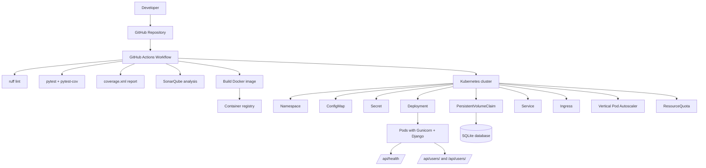

# Demo Devops Python

This is a simple application to be used in the technical test of DevOps.

## Getting Started

### Prerequisites

- Python 3.11.3

### Installation

Clone this repo.

```bash
git clone https://bitbucket.org/devsu/demo-devops-python.git
```

Install dependencies.

```bash
pip install -r requirements.txt
```

Migrate database

```bash
py manage.py makemigrations
py manage.py migrate
```

### Database

The database is generated as a file in the main path when the project is first run, and its name is `db.sqlite3`.

Consider giving access permissions to the file for proper functioning.

## Usage

### 1. Preparar el entorno local

Create and activate your virtual environment:

```bash
python3 -m venv .venv
source .venv/bin/activate
```

Install dependencies:

```bash
pip install -r requirements.txt
pip install -r requirements-dev.txt
```

Create your environment file:

```bash
cp .env.example .env
```

Edit `.env` and make sure it contains at least:

```env
DJANGO_SECRET_KEY=your-secret-key
DATABASE_NAME=db.sqlite3
DEBUG=True
ALLOWED_HOSTS=127.0.0.1,localhost
```

Apply migrations:

```bash
python manage.py migrate
```

Run the development server:

```bash
python manage.py runserver 0.0.0.0:8000
```

Verify the app is running:

```bash
curl http://localhost:8000/api/health/
```

### 2. Ejecutar pruebas

Run all tests:

```bash
pytest
```

Run tests with coverage:

```bash
pytest --cov=api --cov=demo --cov-report=term-missing
```

Run linting:

```bash
ruff check .
```

### 3. Consumir la API

Example requests:

```bash
curl http://localhost:8000/api/users/
```

```bash
curl -X POST http://localhost:8000/api/users/ \
  -H "Content-Type: application/json" \
  -d '{"dni":"12345678","name":"Test User"}'
```

```bash
curl http://localhost:8000/api/users/1/
```

### 4. Ejecutar con Docker

Build the image:

```bash
docker build -t devsu-demo-python:latest .
```

Run it:

```bash
docker run --env-file .env -p 8000:8000 devsu-demo-python:latest
```

### 5. Ejecutar con Docker Compose

```bash
docker compose up --build
```

### 6. Desplegar en Kubernetes

Make sure `kubectl` is configured and your cluster is accessible:

```bash
kubectl apply -k k8s
```

Check the deployment status:

```bash
kubectl get pods -n devsu-demo-python
kubectl get svc -n devsu-demo-python
kubectl get ingress -n devsu-demo-python
```

Test the health endpoint from the cluster:

```bash
kubectl port-forward -n devsu-demo-python svc/devsu-demo-python 8000:80
curl http://localhost:8000/api/health/
```

### 7. Preparar variables y secretos para CI/CD

The GitHub Actions workflow expects the following secrets and variables.

#### GitHub repository secrets

Create these in GitHub → Settings → Secrets and variables → Actions:

- `SONAR_TOKEN`: token de SonarQube/SonarCloud
- `SONAR_HOST_URL`: URL del servidor SonarQube
- `DOCKERHUB_USERNAME`: usuario del registry Docker Hub
- `DOCKERHUB_TOKEN`: token del registry Docker Hub
- `KUBE_CONFIG_DATA`: kubeconfig en base64

#### Example for Kubernetes secret

If you want to create the Kubernetes secret manually:

```bash
kubectl create secret generic devsu-demo-python-secret \
  --from-literal=DJANGO_SECRET_KEY='your-secret-key' \
  -n devsu-demo-python
```

#### Example for TLS secret

If you want HTTPS on ingress:

```bash
kubectl create secret tls devsu-demo-python-tls \
  --cert=./tls.crt \
  --key=./tls.key \
  -n devsu-demo-python
```

### 8. Probar el pipeline completo

Push your changes to GitHub and confirm that GitHub Actions runs:

1. lint with `ruff`
2. tests with `pytest`
3. coverage report generation
4. SonarQube analysis if the secrets are present
5. Docker image build
6. deployment to Kubernetes if `KUBE_CONFIG_DATA` is present

### 9. Validación final recomendada

After deployment, verify the end-to-end flow:

```bash
curl http://localhost:8000/api/health/
curl http://localhost:8000/api/users/
```

If you deployed in Kubernetes, also verify:

```bash
kubectl get vpa -n devsu-demo-python
kubectl describe quota -n devsu-demo-python
```

## Docker

This project includes Docker support.

Build the image locally:

```bash
docker build -t devsu-demo-python:latest .
```

Run with Docker:

```bash
docker run --env-file .env -p 8000:8000 devsu-demo-python:latest
```

Or use docker compose:

```bash
docker compose up --build
```

## Kubernetes deployment

Kubernetes manifests are available in the `k8s/` folder. The deployment includes:

- Namespace
- ConfigMap
- Secret
- PersistentVolumeClaim for SQLite data
- ResourceQuota
- Deployment with 1 replica (Recreate strategy, SQLite on a ReadWriteOnce PVC)
- Service
- Ingress
- Vertical Pod Autoscaler (VPA)
- Liveness and readiness probe on `/api/health/`

Apply the resources with:

```bash
kubectl apply -k k8s
```

The namespace is centralized in [k8s/kustomization.yaml](k8s/kustomization.yaml), so you can change it in one place before deploying.

> Note: replace the placeholder secret value in `k8s/secret.yaml` and update the image name in `k8s/deployment.yaml` before deploying.

## CI/CD Pipeline

A GitHub Actions pipeline is defined in `.github/workflows/ci-cd.yml`.

It runs:

- Build and install dependencies
- Static analysis with `ruff`
- Unit tests with `pytest` and Django
- Coverage report generation
- Optional SonarQube analysis when `SONAR_HOST_URL` and `SONAR_TOKEN` are configured
- Docker image build
- Optional Docker push when `DOCKERHUB_USERNAME` and `DOCKERHUB_TOKEN` are configured
- Optional Kubernetes deployment when `KUBE_CONFIG_DATA` is configured

## API endpoints

- `GET /api/users/` — list all users
- `POST /api/users/` — create a new user
- `GET /api/users/<id>/` — retrieve one user by id
- `GET /api/health/` — health check

### Create User

To create a user, call the endpoint **/api/users/** with the following body:

```json
{
    "dni": "dni",
    "name": "name"
}
```

Successful response:

```json
{
    "id": 1,
    "dni": "dni",
    "name": "name"
}
```

If the user already exists, the service returns status 400:

```json
{
    "detail": "User already exists"
}
```

### Get Users

Call **GET /api/users/** to list users.

### Get User

Call **GET /api/users/<id>** to retrieve one user.

If the user does not exist, the service returns status 404.

## Architecture

A detailed architecture description is available in `ARCHITECTURE.md`.

### CI/CD full architecture diagram



## License

Copyright © 2023 Devsu. All rights reserved.
