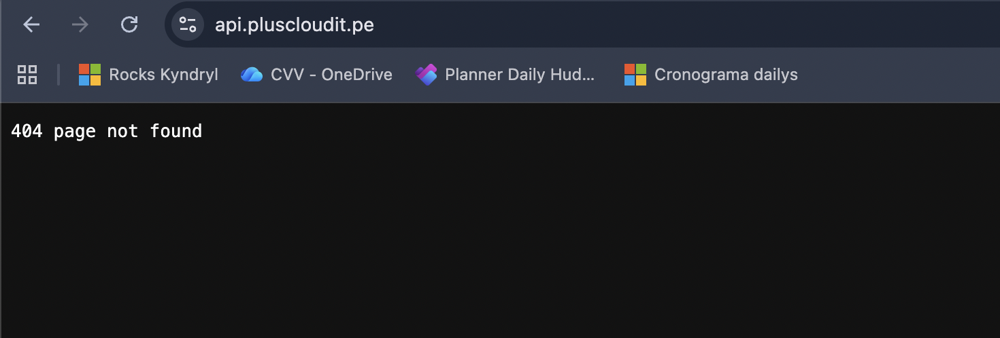
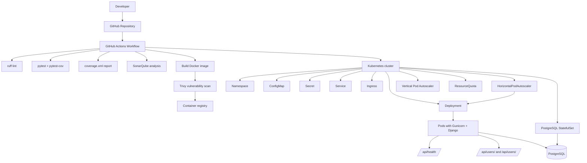

# Demo Devops Python

This is a simple application to be used in the technical test of DevOps.

## Getting Started

### Prerequisites

- Python 3.11.3

### Installation

Clone this repo.

```bash
git clone https://bitbucket.org/devsu/demo-devops-python.git
```

Install dependencies.

```bash
pip install -r requirements.txt
```

> Database setup (PostgreSQL) and migrations are covered step by step in
> [Usage → 1. Preparar el entorno local](#1-preparar-el-entorno-local).
> The app needs a running PostgreSQL and the `DATABASE_*` env vars before migrating.

### Database

The application uses **PostgreSQL**. Connection settings are read from environment variables
(`DATABASE_NAME`, `DATABASE_USER`, `DATABASE_PASSWORD`, `DATABASE_HOST`, `DATABASE_PORT`).

> SQLite was replaced by PostgreSQL: SQLite is a single-writer file-based database and cannot be
> shared across multiple replicas, which prevents horizontal scaling. PostgreSQL makes the app
> stateless so it can run with several replicas behind an HPA.

For local development you can start a PostgreSQL instance with `docker compose up db`, or run the
full stack (app + database) with `docker compose up --build`.

## Usage

### 1. Preparar el entorno local

Create and activate your virtual environment:

```bash
python3 -m venv .venv
source .venv/bin/activate
```

Install dependencies:

```bash
pip install -r requirements.txt
pip install -r requirements-dev.txt
```

Create your environment file:

```bash
cp .env.example .env
```

Edit `.env` and make sure it contains at least:

```env
DJANGO_SECRET_KEY=your-secret-key
DEBUG=True
ALLOWED_HOSTS=127.0.0.1,localhost
DATABASE_NAME=devsu
DATABASE_USER=devsu
DATABASE_PASSWORD=devsu
DATABASE_HOST=localhost
DATABASE_PORT=5432
```

> The local migrations/runserver steps require a running PostgreSQL. The quickest way is
> `docker compose up db` (exposes PostgreSQL on `localhost:5432` with the credentials above).

Apply migrations:

```bash
python manage.py migrate
```

Run the development server:

```bash
python manage.py runserver 0.0.0.0:8000
```

Verify the app is running:

```bash
curl http://localhost:8000/api/health/
```

### 2. Ejecutar pruebas

Run all tests:

```bash
pytest
```

Run tests with coverage:

```bash
pytest --cov=api --cov=demo --cov-report=term-missing
```

Run linting:

```bash
ruff check .
```

### 3. Consumir la API

Example requests:


### 4. Ejecutar con Docker

Build the image:

```bash
docker build -t devsu-demo-python:latest .
```

Run it:

```bash
docker run --env-file .env -p 8000:8000 devsu-demo-python:latest
```

### 5. Ejecutar con Docker Compose

```bash
docker compose up --build
```

### 6. Desplegar en Kubernetes

#### Prerequisites

- `kubectl` configured against a reachable cluster.
- An **ingress controller** that provides the `traefik` IngressClass. The CI/CD pipeline
  installs Traefik automatically via Helm; for a manual `kubectl apply -k k8s` you must install
  it yourself (e.g. `helm install traefik traefik/traefik -n traefik --create-namespace`).
  Without it the pods still run, but the `Ingress` won't route external traffic.
- **metrics-server** installed, otherwise the HPA reports `<unknown>` and won't scale:
  `kubectl get deployment metrics-server -n kube-system`.
- Set a real **database password** in `k8s/secret.yaml` (`DATABASE_PASSWORD`) **before the first
  apply** — PostgreSQL only reads it when it initializes its volume for the first time.

#### Deploy

```bash
kubectl apply -k k8s
```

Check the deployment status (PostgreSQL comes up first, then the app pods run
`wait-for-db` → `migrate` init containers before serving):

```bash
kubectl get pods -n devsu-demo-python
kubectl get statefulset -n devsu-demo-python
kubectl get svc,ingress,hpa -n devsu-demo-python
```

Test the health endpoint. If the cluster IP is reachable from your machine, use `port-forward`:

```bash
kubectl port-forward -n devsu-demo-python svc/devsu-demo-python 8000:80
curl http://localhost:8000/api/health/
```

If you cannot reach the cluster network directly (e.g. Rancher web shell), test from inside a pod:

```bash
kubectl exec -n devsu-demo-python deploy/devsu-demo-python -c web -- \
  python -c "import urllib.request; print(urllib.request.urlopen('http://localhost:8000/api/health/').read())"
```

### 7. Preparar variables y secretos para CI/CD

The GitHub Actions workflow expects the following secrets and variables.

#### GitHub repository secrets

Create these in GitHub → Settings → Secrets and variables → Actions:

- `SONAR_TOKEN`: token de SonarQube/SonarCloud
- `SONAR_HOST_URL`: URL del servidor SonarQube
- `DOCKERHUB_USERNAME`: usuario del registry Docker Hub
- `DOCKERHUB_TOKEN`: token del registry Docker Hub
- `KUBE_CONFIG_DATA`: kubeconfig en base64

#### Example for Kubernetes secret

If you want to create the Kubernetes secret manually:

```bash
kubectl create secret generic devsu-demo-python-secret \
  --from-literal=DJANGO_SECRET_KEY='your-secret-key' \
  --from-literal=DATABASE_PASSWORD='your-db-password' \
  -n devsu-demo-python
```

#### Example for TLS secret

If you want HTTPS on ingress:

```bash
kubectl create secret tls devsu-demo-python-tls \
  --cert=./tls.crt \
  --key=./tls.key \
  -n devsu-demo-python
```

### 8. Probar el pipeline completo

Push your changes to GitHub and confirm that GitHub Actions runs:

1. lint with `ruff`
2. tests with `pytest`
3. coverage report generation
4. SonarQube analysis if the secrets are present
5. Docker image build
6. vulnerability scan of the image with Trivy
7. image push and deployment to Kubernetes if the credentials/`KUBE_CONFIG_DATA` are present

### 9. Validación final recomendada

After deployment, verify the end-to-end flow:

```bash
curl http://localhost:8000/api/health/
curl http://localhost:8000/api/users/
```

If you deployed in Kubernetes, also verify:

```bash
kubectl get pods -n devsu-demo-python
kubectl get hpa -n devsu-demo-python
kubectl get statefulset -n devsu-demo-python
kubectl get vpa -n devsu-demo-python
kubectl describe quota -n devsu-demo-python
```

## Docker

This project includes Docker support.

Build the image locally:

```bash
docker build -t devsu-demo-python:latest .
```

Run with Docker:

```bash
docker run --env-file .env -p 8000:8000 devsu-demo-python:latest
```

Or use docker compose:

```bash
docker compose up --build
```

## Kubernetes deployment

Kubernetes manifests are available in the `k8s/` folder. The deployment includes:

- Namespace
- ConfigMap
- Secret
- PostgreSQL StatefulSet + headless Service (with its own ReadWriteOnce volume)
- ResourceQuota
- Deployment (stateless, 2 replicas, RollingUpdate; initContainers wait-for-db + migrate)
- Service
- Ingress
- HorizontalPodAutoscaler (HPA): 2–5 replicas, scales on CPU/memory
- Vertical Pod Autoscaler (VPA)
- Liveness, readiness and startup probes on `/api/health/`

Apply the resources with:

```bash
kubectl apply -k k8s
```

The namespace is centralized in [k8s/kustomization.yaml](k8s/kustomization.yaml), so you can change it in one place before deploying.

> Note: replace the placeholder secret value in `k8s/secret.yaml` and update the image name in `k8s/deployment.yaml` before deploying.

## CI/CD Pipeline

A GitHub Actions pipeline is defined in `.github/workflows/ci-cd.yml`.

It runs:

- Build and install dependencies
- Static analysis with `ruff`
- Unit tests with `pytest` and Django
- Coverage report generation
- Optional SonarQube analysis when `SONAR_HOST_URL` and `SONAR_TOKEN` are configured
- Docker image build
- Vulnerability scan of the built image with Trivy (fails on fixable HIGH/CRITICAL CVEs)
- Optional Docker push when `DOCKERHUB_USERNAME` and `DOCKERHUB_TOKEN` are configured
- Optional Kubernetes deployment when `KUBE_CONFIG_DATA` is configured

## API endpoints

- `GET /api/users/` — list all users
- `POST /api/users/` — create a new user
- `GET /api/users/<id>/` — retrieve one user by id
- `GET /api/health/` — health check

### Create User

To create a user, call the endpoint **/api/users/** with the following body:

```json
{
    "dni": "dni",
    "name": "name"
}
```

Successful response:

```json
{
    "id": 1,
    "dni": "dni",
    "name": "name"
}
```

If the user already exists, the service returns status 400:

```json
{
    "detail": "User already exists"
}
```

### Get Users

Call **GET /api/users/** to list users.

### Get User

Call **GET /api/users/<id>** to retrieve one user.

If the user does not exist, the service returns status 404.

## Architecture

A detailed architecture description is available in `ARCHITECTURE.md`.

### CI/CD full architecture diagram



## License

Copyright © 2023 Devsu. All rights reserved.
